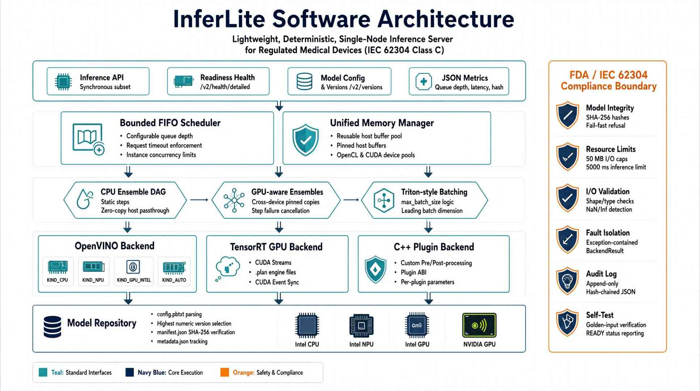

# InferLite

A lightweight, deterministic, single-node inference server for a fixed
industrial workstation. It adopts the proven, reference-aligned architecture of
a production serving framework — model repository, backend abstraction, bounded
scheduling, and reusable memory — while dropping all cloud-scale, multi-tenant,
and dynamic operations that add unnecessary complexity on the factory floor.

It ships with two backends — a CPU/runtime backend built on OpenVINO and an
opt-in **TensorRT GPU backend** — and runs as a validated, deterministic
component of a regulated medical device. See
[`docs/COMPLIANCE.md`](docs/COMPLIANCE.md) for the FDA / medical-device
compliance posture.

The GPU backend is compiled only when a TensorRT SDK is available at CMake
configure time (`-DTENSORRT_ROOT=...`); without it the server builds and runs
CPU-only with no regression. Intel CPU / NPU / Intel GPU / AUTO execution is
provided by the OpenVINO backend and selected through `instance_group.kind`
(`KIND_CPU` / `KIND_NPU` / `KIND_GPU_INTEL` / `KIND_AUTO`).

## Motivations
- Nvidia phased out the triton inference server's windows support.

## Concept


## Vision (from `docs/PRD-all.md`)

- **Reference-aligned architecture** — model repository layout, model
  configuration, backend interface, instance groups, and tensor sharing.
- **Multi-backend support** — native backends for GPU acceleration and CPU.
- **C++ plugin system** — custom pre-/post-processing nodes running inside the
  pipeline graph as if they were backends.
- **Concurrent execution** — multiple model instances and plugin nodes run in
  parallel.
- **Zero-copy pipelines** — data is passed by reference between adjacent steps
  on the same device.
- **Deterministic, low-latency serving** — static graph, no request-combining
  dynamic batching, no hot reloading, minimal scheduling overhead. Triton-style
  batch-dimension shapes are supported via `max_batch_size` (see Features).
- **Standard interface** — a compatible, synchronous subset of the reference
  server's request API plus health and JSON metrics.

## Medical Equipment Level & FDA Compliance

InferLite is architected as a **Class C software component of a regulated
medical device** (IEC 62304), with model-integrity verification, deterministic
execution, input/output validation, fault isolation, resource limits, and a
tamper-evident audit trail. Full details — the regulatory framework, safety
mechanisms, validated (locked) mode, required documentation package, and
security/privacy notes — live in **[`docs/COMPLIANCE.md`](docs/COMPLIANCE.md)**.

## Features

- **Model repository** — parses model configuration files, picks the highest
  numeric version directory for each model.
- **Scheduler** — bounded FIFO request queue with configurable depth and request
  timeout; at most `instance_group.count` requests run concurrently per model.
- **Memory management** — pool of reusable host buffers, pinned host buffers, and
  OpenCL device-buffer bookkeeping for device data staging.
- **CPU backend** — wraps the framework's compiled-model object.
- **Interface** — inference, readiness health, model config, and JSON metrics.
- **Fail-fast startup** — unsupported configurations abort the server.
- **Model integrity & traceability** — `manifest.json` with SHA-256 hashes
  (including precompiled NPU/GPU blobs); verified at startup; mismatches cause
  fail-fast refusal to start. `metadata.json` carries `model_id`, `version`,
  `intended_use`, `approval_status`.
- **Deterministic resource limits** — input/output size caps (50 MB default),
  per-request inference time limit (5000 ms), bounded queue.
- **Input/output validation** — strict tensor shape/type/size checks; output
  NaN/Inf/range detection; structured error codes (`INVALID_INPUT`,
  `OUTPUT_VALIDATION_FAILED`, `RESOURCE_EXHAUSTED`, `TIMEOUT`, ...).
- **Fault isolation** — every backend call is exception-contained and returns a
  `BackendResult`; no silent failures.
- **Tamper-evident audit log** — append-only, hash-chained JSON entries
  (`trace_id`, model/config hashes, software version, duration, device).
- **Health & startup self-test** — golden-input verification per model; server
  reports `READY` only if all self-tests pass. `GET /v2/health/detailed` gives
  per-model status.
- **Config & version management** — config/manifest hashing, software + OpenVINO
  version reporting via `GET /v2/versions`.
- **CPU ensemble DAG executor** — static `ensemble_scheduling` steps with
  zero-copy host memory passthrough; a step failure cancels the whole pipeline.
- **C++ plugin backend** — shared libraries implementing the InferLite plugin
  ABI, loaded at startup, hash-verified against the manifest, and executed on
  the CPU thread pool.
- **Per-plugin parameters** — a Triton-style `parameters` block in
  `config.pbtxt` passes key/value strings to each plugin node at creation, so
  multiple pipelines can each own their own pre-/post-processing while sharing
  the same plugin DLL.
- **Metrics** — queue depth, per-model latency, and a configuration hash.
- **Intel CPU execution** — compiles the IR (`model.xml`/`model.bin`) on the
  OpenVINO CPU plugin; thread/stream tuning applied only where the plugin
  accepts it.
- **Intel NPU execution** — loads a precompiled `model.npu_blob` via
  `ov::Core::import_model`.
- **Intel GPU execution** — loads a precompiled `model.gpu_blob` via
  `ov::Core::import_model`.
- **Intel AUTO execution** — lets OpenVINO select the best available Intel device
  (NPU > GPU > CPU); imports an existing blob for that device or compiles the IR.
- **Triton-compatible device selection** — `instance_group.kind` chooses the
  execution device: `KIND_CPU`, `KIND_NPU`, `KIND_GPU_INTEL`, or `KIND_AUTO`.
- **Device reporting** — health/detailed, metrics, and audit logs report the
  resolved execution device per model (`CPU`, `NPU`, `INTEL_GPU`, `AUTO`).
- **Device model tooling** — `tools/make_device_models.py` generates CPU/NPU/GPU/
  AUTO sample models, exporting precompiled blobs when the corresponding Intel
  hardware is present; reference configs live in `tools/examples/`.
- **Triton-style batching** — `max_batch_size` follows Triton's convention: `0`
  disables batching (tensor shapes match `dims` exactly); `>0` enables a leading
  batch dimension on request/output tensors where config `dims` are per-request
  and the accepted batch is `1 <= B <= max_batch_size`. With `max_batch_size: 1`
  a model whose IR accepts `[1, 4]` declares `dims: [4]` and clients send/receive
  shape `[1, 4]`. `tools/make_batched_model.py` generates such a model; see
  `scripts/test_batch.ps1`.

- **TensorRT GPU backend** (opt-in) — deserializes approved `model.plan` engine
  files; each instance owns a CUDA stream; `execute()` enqueues on the stream
  and synchronizes via a CUDA event. Runs under the same FDA safety boundary as
  the CPU runtime.
- **GPU memory manager** — a reusable CUDA device buffer pool plus a pinned host
  pool for efficient host↔device transfers.
- **GPU instance groups** — `kind: KIND_GPU` with a `count` for TensorRT models;
  multiple GPU instances run concurrently on separate streams and alongside CPU
  models.
- **Unified scheduler** — manages both CPU and GPU instances with busy/free
  tracking and quarantine of a CUDA-faulted instance (fault isolation).
- **GPU-aware ensembles** — DAGs may mix CPU and TensorRT nodes; cross-device
  edges use explicit pinned copies, and a step failure cancels the ensemble.
- **FDA controls extended to GPU** — `.plan` files are SHA-256 hashed and listed
  in the manifest, outputs are validated after the device→host copy, the audit
  log records `device: "GPU"`, and `MAX_GPU_MEMORY_MB` /
  `MAX_INFERENCE_TIME_MS` bound GPU execution.

### Not yet implemented

OpenVINO multi-GPU, live model updates, a profiling tool, and gRPC streaming.
Request-combining dynamic batching is on the roadmap (see **Planned**);
Triton-style batch-dimension shapes via `max_batch_size` are already
implemented (see Features).

### gRPC interface

A Triton/KServe v2-compatible gRPC interface (`GRPCInferenceService`) is
implemented (health, server/model metadata, model config, and `ModelInfer`) and
shares the same inference core as HTTP. It is **opt-in** and disabled by
default. Build it against a source-built gRPC (vcpkg) with
`scripts/build_grpc.ps1`. The gRPC C++ runtime must be built with an MSVC
toolchain whose STL/CRT ABI matches the compiler used here; a prebuilt gRPC DLL
stack built with an older MSVC crashes on RPC dispatch due to an ABI mismatch.
See `docs/GRPC.md` for details and `scripts/build_grpc.ps1` /
`scripts/test_grpc_server.ps1` for build/test.

### Planned

- **Request-combining dynamic batching** — the scheduler collecting queued
  concurrent requests and executing them as a single combined inference
  (bounded by `max_batch_size`), then splitting outputs back per request. The
  batch-dimension shape convention is already implemented.
- **Live model updates** — reloading or hot-swapping models at runtime.
- **Profiling tool** — latency and throughput profiling across devices.
- **In-process API** — embed the engine as a shared library (Triton-style
  `TRITONSERVER_Server` C API): expose a library target, and add an
  `extern "C"` embedding interface for C/C++/Python callers without network
  overhead.

## Layout

```
models/
  <model_name>/
    config.pbtxt
    metadata.json         # FDA model metadata (optional)
    manifest.json         # repository-level approved-model manifest (validated mode)
    <version>/            # highest numeric version is used
      model.xml
      model.bin
src/
  main.cpp                 # CLI + fail-fast startup + Windows service control
  service_support.*        # Windows service (SCM) install/uninstall/run
  infer_lite.*             # app wiring + routing + audit/validation orchestration
  http_server.*            # HTTP/1.1 server (thread pool)
  grpc_server.*            # gRPC GRPCInferenceService (opt-in, see docs/GRPC.md)
  json.*                   # minimal JSON parser/serializer
  pbtxt.*                  # model configuration parser
  model_repository.*       # repository scan + validation
  backend.hpp              # abstract backend interface (BackendResult)
  openvino_backend.*       # OpenVINO backend (CPU / NPU / Intel GPU / AUTO)
  plugin_backend.*         # C++ plugin backend (shared-library ABI)
  plugin_api.hpp           # plugin ABI (inferlite_plugin_*)
  ensemble_executor.*      # CPU ensemble DAG executor (zero-copy host memory)
  scheduler.*              # bounded FIFO scheduler (with inference time limit)
  memory_manager.*         # host + pinned + device-buffer memory pools
  audit_log.*              # tamper-evident hash-chained audit log
  config_store.*           # manifest/metadata/self-test/hash management
  validation.*             # input/output validation, batch-dim, structured errors
  sha256.*                 # SHA-256 hashing
  tensor.hpp               # tensor/data-type definitions
  diagnostics.*            # engineer-facing diagnostic log
proto/
  grpc_service.proto       # KServe/Triton v2 gRPC protocol (opt-in)
generated/                 # protoc-generated C++/Python stubs from proto/
scripts/
  build.ps1 / build.bat    # HTTP-only build
  build_gpu.ps1            # TensorRT/GPU build
  build_grpc.ps1           # gRPC build (opt-in, requires gRPC SDK)
  gen_grpc*.ps1            # regenerate protobuf/gRPC C++ & Python stubs
  test_*.ps1               # HTTP / GPU / gRPC test suites
  test_batch.ps1           # Triton-style batching (max_batch_size) test
  service.ps1              # Windows service install/start/stop/status/uninstall
  test_service.ps1         # Windows service + console regression test
third_party/
  grpc/importlibs/         # regenerated gRPC DLL import libs (Anaconda stack only)
  dist/                    # packaged distribution (runtime DLLs + models)
tools/
  make_sample_model.py     # generates models/sample_model (IR + config + metadata)
  make_device_models.py    # generates CPU/NPU/GPU/AUTO device sample models
  make_multi_io_model.py   # generates models/multi_io_model (2-in/2-out array syntax)
  make_batched_model.py    # generates models/batched_model (Triton max_batch_size)
  make_manifest.py         # generates models/manifest.json with SHA-256 hashes
  examples/                # reference configs (kind: KIND_NPU / KIND_GPU_INTEL / KIND_AUTO)
  sample_plugin/           # example CPU plugin source (sample_plugin.dll)
```

## Build

Prerequisites:

- Microsoft Visual Studio 2022 (MSVC C++ x64 toolset)
- CMake + Ninja (shipped with VS)
- OpenVINO 2025.3 Windows C++ runtime (extracted under `c:\tools\openvino`, or
  point CMake at it with `-DOPENVINO_ROOT=...`)
- (Optional, for the GPU backend) NVIDIA TensorRT SDK + CUDA; set `TENSORRT_ROOT`
  to the TensorRT install directory at CMake configure time.

```
powershell -ExecutionPolicy Bypass -File scripts\build.ps1
```

CPU-only by default. To enable the GPU backend:

```
powershell -ExecutionPolicy Bypass -File scripts\build_gpu.ps1
```

or manually:

```
cmake -S . -B build-gpu -DOPENVINO_ROOT=c:\tools\openvino -DTENSORRT_ROOT=C:\TensorRT
cmake --build build-gpu --config Release
```

> **GPU hardware note:** TensorRT 10.x requires a GPU with **SM ≥ 7.5**
> (GTX 16xx / RTX 20xx or newer). Pascal-era GPUs such as the GTX 10xx (SM 6.1)
> are not supported and engine build/execution fails with
> `Target GPU SM 61 is not supported`. The GPU backend still compiles and runs
> (reporting `gpu.enabled:true`), but end-to-end GPU inference needs a supported
> card or a TensorRT release that still supports Pascal (e.g. TRT 8.x).

The build also produces `build\sample_plugin.dll` (example plugin). To use the
plugin/ensemble demo models, copy the DLL into each plugin model directory:

```
Copy-Item build\sample_plugin.dll models\preprocess_plugin\
Copy-Item build\sample_plugin.dll models\postprocess_plugin\
```

Each plugin model's `config.pbtxt` may carry a `parameters` block that
configures the node independently (see "Plugin & ensemble testing" below).

The build copies the required runtime libraries next to `build\inferlite.exe`.

## Run

```
build\inferlite.exe --model-repository=models --http-port=8000 \
    --max-queue-size=100 --http-threads=4
```

Validated mode (requires `models\manifest.json`; enables self-test readiness):

```
build\inferlite.exe --model-repository=models --http-port=8000 --validated-mode \
    --audit-log=build\audit.log --diagnostic-log=build\diag.log
```

Options:

| Flag | Default | Description |
|------|---------|-------------|
| `--model-repository=<path>` | (required) | Model repository root |
| `--host=<addr>` | `0.0.0.0` | Listen address |
| `--http-port=<port>` | `8000` | HTTP port |
| `--grpc-port=<port>` | `0` | gRPC port (`0` = disabled; requires gRPC build) |
| `--max-queue-size=<n>` | `100` | Max queued requests (0 = unbounded) |
| `--request-timeout-ms=<n>` | `30000` | Per-request queue timeout |
| `--http-threads=<n>` | `4` | HTTP worker threads |
| `--validated-mode` | off | Require manifest; self-test gates readiness |
| `--audit-log=<path>` | off | Tamper-evident audit log file |
| `--diagnostic-log=<path>` | off | Engineer-facing diagnostic log file |
| `--max-input-size-bytes=<n>` | `52428800` | Input size limit |
| `--max-output-size-bytes=<n>` | `52428800` | Output size limit |
| `--max-inference-time-ms=<n>` | `5000` | Per-request inference time limit |
| `--tls-cert=<path>` / `--tls-key=<path>` | – | TLS cert/key (validated deployments front the server with a TLS 1.2+ reverse proxy) |
| `--software-version=<s>` | `InferLite 2.0.0` | Reported software version |
| `--max-gpu-memory-mb=<n>` | `2048` | Per-model GPU memory cap (TensorRT) |
| `--max-concurrent-gpu-instances=<n>` | `4` | Max concurrent GPU instances |
| `--gpu-device=<n>` | `0` | CUDA device index (single GPU only) |
| `--model-control-mode=<m>` | `none` | Triton model-control mode: `none` \| `poll` \| `explicit` (see “Model management”) |
| `--repository-poll-secs=<n>` | `15` | Repository poll interval (seconds; `poll` mode only) |
| `--load-model=<name>` | – | Model(s) to load at startup in `explicit` mode; repeatable; `*` loads all |
| `--install-service` | – | Register this exe as a Windows service (admin) |
| `--uninstall-service` | – | Remove the registered Windows service (admin) |
| `--service` | – | Run under the Windows Service Control Manager (falls back to console if launched manually) |
| `--service-name=<name>` | `InferLite` | Service name to install / run |
| `--service-display=<name>` | `InferLite Inference Server` | Display name used at install |
| `--install-service-user=<user>` / `--install-service-password=<pw>` | – | Service account for the installed service (default: LocalSystem) |

## Run as a Windows service

InferLite runs either as a normal console/cmd process (the default) or as a
managed **Windows service** under the Service Control Manager (SCM). Both modes
use the same binary and the same command-line grammar.

**Install** (run from an elevated PowerShell — LocalSystem account by default):

```
powershell -ExecutionPolicy Bypass -File scripts\service.ps1 -Action install `
    -ModelRepository C:\Test\triton\inferlite\models -HttpPort 8000
```

Equivalently, invoke the binary directly:

```
build\inferlite.exe --install-service --model-repository=C:\models --http-port=8000
```

The installed service is **auto-start** and records the supplied arguments in
the registry (`Services\<name>\Parameters\ConfigArgs`), reproducing them each
time the service is started. To run under a specific service account, pass
`-ServiceUser` / `-ServicePassword` (or the `--install-service-user=` /
`--install-service-password=` flags).

**Manage**:

```
powershell -ExecutionPolicy Bypass -File scripts\service.ps1 -Action start
powershell -ExecutionPolicy Bypass -File scripts\service.ps1 -Action status
powershell -ExecutionPolicy Bypass -File scripts\service.ps1 -Action stop
powershell -ExecutionPolicy Bypass -File scripts\service.ps1 -Action restart
powershell -ExecutionPolicy Bypass -File scripts\service.ps1 -Action uninstall
```

or with the standard `sc.exe` tool (`sc start InferLite`, `sc stop InferLite`,
`sc delete InferLite`).

**Notes**

- `--install-service` / `--uninstall-service` must be run from an **elevated**
  prompt (they call the SCM APIs).
- `--service` starts the server under the SCM and blocks until the service is
  stopped; a stop request (`sc stop`, shutdown) triggers a graceful shutdown
  (health port stops, listeners close, audit log finalized). If the binary is
  launched with `--service` **manually** from a cmd window (not by the SCM), it
  falls back to a normal foreground console run so it never silently exits.
- When run as a service, open a console/event-log or the `--diagnostic-log`
  file to see startup errors (there is no console window under SCM). A
  tamper-evident `--audit-log` is recommended for validated deployments.
- The service defaults to LocalSystem; give it the access it needs to the model
  repository and any audit/diagnostic log directories.

## Interface

### Readiness
```
GET /v2/health/ready      -> 200 {"status":"READY"}  (only if self-tests passed)
GET /v2/health/detailed   -> per-model status + hashes + versions
GET /v2/versions          -> software + OpenVINO + model versions
```

### Model config
```
GET /v2/models/<model_name>/config   -> parsed config + config/model hashes
```

### Inference
```
POST /v2/models/<model_name>/infer
Content-Type: application/json
{
  "inputs": [
    {"name": "input", "shape": [1, 4], "datatype": "FP32",
     "data": [1.0, 2.0, 3.0, 4.0]}
  ]
}
```
`data` may be a JSON number array (serialized per `datatype`) or a base64
string. The response contains `outputs` (base64 `data`) and a `trace_id`.

**Batched models.** For a model with `max_batch_size > 0`, the request/output
`shape` must include the leading batch dimension `B` (`1 <= B <= max_batch_size`)
prepended to the per-request config `dims`. With `max_batch_size: 1`, a model
declaring `dims: [4]` is queried with `shape: [1, 4]`.

### Metrics
```
GET /v2/metrics    -> requests counts, average latency, queue depth, config hash
```

### Model management (Triton model-control modes)

InferLite follows NVIDIA Triton’s model management model. The repository layout,
startup behavior, and runtime load/unload policy are selected with
`--model-control-mode`:

| Mode | Startup | Runtime repository changes | Control API (load/unload) |
|------|---------|---------------------------|---------------------------|
| `none` (default) | load **all** models; any invalid model aborts startup (fail-fast, legacy behavior) | ignored | disabled (rejected with `400`) |
| `poll` | attempt to load **all** models; a model that fails is reported `UNAVAILABLE`, not fatal | polled every `--repository-poll-secs`; **new** models are loaded, **changed** models reloaded, **removed** models unloaded | disabled (rejected with `400`) |
| `explicit` | load only `--load-model` names (`*` = all; none if omitted) | ignored until driven through the API | **enabled** — the intended operating mode |

Modes `poll` and `explicit` never abort the server because one model is broken:
failures mark that model `UNAVAILABLE` (with a `reason`) in the index while the
rest keep serving. A model is reported `READY` only after it loads **and** passes
its configured golden-input self-test. When a model that ensembles depend on is
reloaded or removed, the referencing ensembles are reloaded/unloaded with it
(`unload_dependents`).

Repository-control endpoints (only `POST`):

```
POST /v2/repository/index                                      # list models + state
  body (optional): {"ready": true|false}                       # filter to READY only
  -> 200 [ {"name":..., "version":..., "state":"READY|UNAVAILABLE", "reason":...}, ... ]

POST /v2/repository/models/<model_name>/load
  body (optional): {"parameters": {"config": "<proto-text config.pbtxt override>"}}
  -> 200 (empty) | 400 invalid | 404 not found

POST /v2/repository/models/<model_name>/unload
  body (optional): {"parameters": {"unload_dependents": true|false}}
  -> 200 (empty) | 404 not found | 409 referenced by loaded ensembles
```

The same operations are exposed over gRPC as `RepositoryIndex`,
`RepositoryModelLoad`, and `RepositoryModelUnload` (the server advertises the
`model_repository` extension). Notes:

- The load `config` parameter is a **proto-text** document in the same format as
  `config.pbtxt` (InferLite’s config schema is proto-text, not Triton’s JSON).
  When omitted, the on-disk `config.pbtxt` is used.
- Triton’s inline `file:<version>/<file>` override directories are **not**
  supported (the model directory must exist on disk).
- In `none` mode the `/v2/models/<name>/config` endpoint and inference continue
  to serve every model loaded at startup, exactly as in earlier releases.

## Testing

- `tools/make_sample_model.py` generates the sample OpenVINO model (`y = 2x + 1`).
- `tools/make_device_models.py` generates the CPU/NPU/GPU/AUTO device
  sample models (exporting precompiled blobs when the corresponding Intel
  hardware is present).
- `tools/make_multi_io_model.py` generates the `multi_io_model` (2 inputs, 2
  outputs) that exercises the Triton array-of-message input/output config.
- `tools/make_batched_model.py` generates the `batched_model`
  (`max_batch_size: 1`) that exercises Triton-style batch-dimension shapes:
  config `dims: [4]` while clients send/receive `[1, 4]`.
- `tools/make_manifest.py` generates `models\manifest.json` with SHA-256 hashes.
- `test_batch.ps1` verifies Triton-style batching: valid `[1, 4]` inference
  returns `[3, 5, 7, 9]`, a shape missing the batch dim (`[4]`) and a batch
  exceeding `max_batch_size` (`[2, 4]`) are both rejected with `INVALID_INPUT`.
- `test_human_pose_estimation.py` runs the `human-pose-estimation-0001` model
  end-to-end (keypoint detection + skeleton/heatmap rendering) over **HTTP**
  by default; pass `--grpc` (with `--grpc-server 127.0.0.1:8101`) to run the
  identical test over the gRPC `ModelInfer` RPC — a large-tensor (1×3×256×456
  FP32) request that exercises the binary tensor path over both protocols.
  `test_grpc_server.ps1` includes the gRPC variant as part of the gRPC suite.
- `test_server_phase2.ps1` starts the server in validated mode and exercises
  integrity, validation, ensemble, plugin, audit log, and metrics.
- `test_server_phase4.ps1` starts the server and exercises the
  multi-device models (CPU, NPU, AUTO), verifying device reporting, config
  `kind`, inference, and metrics.
- `test_model_control.ps1` starts the server in each model-control mode and
  verifies the Triton repository-control flow: index state reporting, explicit
  load/unload (including config overrides), poll hot-add/hot-remove, and mode
  gating of the load/unload API.
- `load_test.ps1 -Concurrency <n> -PerWorker <m>` runs a sustained concurrent
  load test.

### Plugin & ensemble testing

A single representative ensemble pipeline ships in `models\`: it chains
`preprocess_plugin → sample_model → postprocess_plugin`, all sharing
`sample_plugin.dll` and `sample_model` (`y = 2x + 1`):

```
ensemble_scheduling {
  step { model_name: "preprocess_plugin"  ... }   # ×0.5 (default)
  step { model_name: "sample_model"       ... }   # 2x + 1
  step { model_name: "postprocess_plugin" ... }   # clamp[0,100] + 0.5
}
```

The sample plugin supports these `parameters` keys (all optional; defaults
preserve the stock pre/post behavior):

| Key | Applies to | Effect |
|-----|-----------|--------|
| `mode` | both | `"preprocess"` \| `"postprocess"` \| `"identity"` (default: inferred from model name) |
| `scale` | preprocess | multiplier applied to every element (default `0.5`) |
| `clamp_min` / `clamp_max` | postprocess | clamp bounds (default `0` / `100`) |
| `offset` | postprocess | value added after clamping (default `0.5`) |

Quick verification (server started in validated mode):

```
POST /v2/models/ensemble_pipeline/infer    -> [2.5, 3.5, 4.5, 5.5]
POST /v2/models/preprocess_plugin/infer    # [2,4,6,8] -> [1.0, 2.0, 3.0, 4.0]
```

Each plugin model carries its own `self_test`, so `--validated-mode` gates
readiness on all of them; `GET /v2/health/detailed` reports each model's
status independently.

## Acknowledgements
- deepseek-v4-flash
